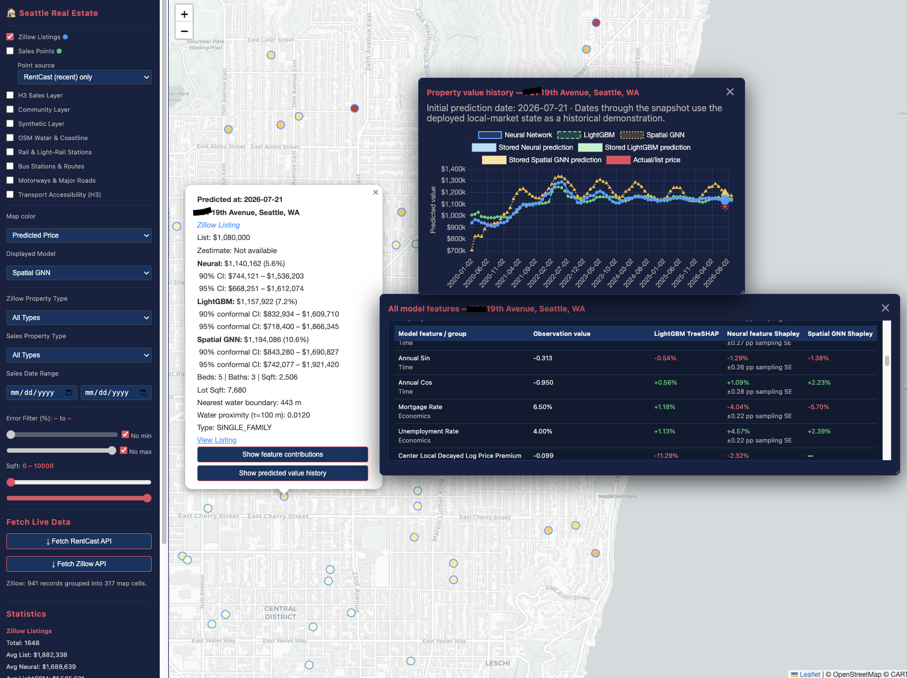

# Project: Spatial Real Estate Price Prediction

### **Executive Summary**
This project delivers an end-to-end house-price prediction pipeline with three deployed models:
*  an attention-based neural network that combines property, time, economic, community, and local H3 neighbourhood-market features;
*  a LightGBM baseline using the corresponding feature set;
*  a GraphSAGE spatial GNN that represents H3 cells as a monthly, leakage-safe graph and learns from neighbouring market states.
All models share core property, seasonal, and economic inputs. They differ primarily in how they represent spatial context: community embeddings and local k-ring market summaries in the neural and LightGBM models, versus monthly graph message passing in the Spatial GNN.


### Data
*   **Historical Residential Sales data:**\
Kaggle [King County Sales](https://www.kaggle.com/datasets/andykrause/kingcountysales/data) Version 8: kingco_sales.csv\
Contains sales of single family homes in King County, sold between 1999 and 2025.
*   **Recent House Sales:**\
RentCast API properties endpoint.
*   **Zillow listings:**\
Fetched from HasData API.
*  **Macroeconomic indicators:**\
FED of St Louis: [FRED graph](https://fred.stlouisfed.org/graph/fredgraph.csv?id=") \
  MORTGAGE30US : 30-year fixed mortgage rate (weekly, %)\
  UNRATE       : US civilian unemployment rate (monthly, %)

### **Feature processing**
* H3 Index for spatial representation
* Louvain graph based community detection used for identification of location submarkets. 

### **Neural Network Architecture**
The core model utilizes a Transformer-inspired architecture adapted for structured tabular data:

*   **Input Representation:** The model ingests heterogeneous data types by projecting them into a shared latent embedding space.
*   **Categorical Embeddings:** A learnable vector representation for *Community* (Location).
*   **Numeric Projections:** Linear projections map numerical groups — property features, continuous time features, and market indicators — into the same latent dimension before they are combined.
*   **Sequence Construction:** These vectors are stacked as tokens to form a sequence, prepended by a learnable **`[CLS]` token**.
*   **Self-Attention Mechanism:** A Multi-Head Attention layer enables every token to interact with every other token. The `[CLS]` token aggregates a global summary of the listing by attending to location, time, property, and market signals.
*   **Regression Head:** The final price prediction is generated from the contextualized `[CLS]` output via a Multi-Layer Perceptron (MLP).
*   **Uncertainty Output:** An optional uncertainty head is available and returns a log-variance estimate alongside the prediction.

### **Spatial GNN baseline**

`main_train_gnn.py` trains a separate monthly H3 level-8 GraphSAGE model. It is
not an extension of the attention model: it has no community embedding and does
not consume the seven-cell local-market tensor attached to individual sales.

* **Graph:** one node per observed H3 cell, linked to its one-ring H3 neighbours.
* **Node state:** leakage-safe monthly market summaries built only from sales
  earlier than that snapshot; two GraphSAGE layers give each cell a two-hop
  receptive field.
* **Price head:** the dated cell embedding is combined with property features,
  continuous annual date features, and dated mortgage/unemployment indicators.
* **Artifacts:** `outputs/gnn/<timestamp>/` contains the PyTorch checkpoint,
  graph state, scalers, metrics, and validation predictions.

```bash
make train-gnn
```

For Java deployment, Python precomputes the causal embedding for every
cell-month and exports the small price head as ONNX. Java therefore does not
reconstruct or run the graph at request time.

### **Pipeline & Data Lifecycle**
The project includes a robust `ModelManager` framework that orchestrates the entire machine learning lifecycle:

*   **Data Ingestion & Engineering:** Automated cleaning, null-handling, and feature derivation (e.g., Log-Price transformation). It handles vocabulary creation for categorical mapping and `StandardScaler` fitting for numerical normalization.
*   **Training Loop:** A custom training cycle utilizing the Adam optimizer and Mean Squared Error (MSE) loss, featuring real-time validation monitoring and attention-weight tracking.
*   **Inference & Analysis:** A prediction engine that reverses transformations to output interpretable prices, calculates percentage errors per listing, and appends results to the original dataset.
*   **Artifact Management:** Automatic serialization of model weights, optimizer states, scalers, and vocabulary dictionaries to JSON and Pickle files, ensuring full reproducibility and easy deployment.

### **Technology Stack**
*   **Core Framework:** PyTorch (Neural Networks, Tensors)
*   **Data Manipulation:** Pandas, NumPy
*   **Preprocessing:** Scikit-Learn (StandardScaler)
*   **Serialization:** Joblib, Pickle, JSON
*   **Java Export:** `deploy_models_for_java.py` stages all three models, verifies
    ONNX parity and the shared feature contract, writes a hash manifest, and
    atomically installs one Java artifact bundle.

For checkout-based development, commands use the `src` package layout:

```bash
python3 -m pip install -e .
# or prefix an individual command with PYTHONPATH=src
```

### **Java Integration**
See [java-app/house-price-app/README.md](https://github.com/zcakg86/pipeline-housing-neural-network/tree/kiraze/java-app/house-price-app) for the Java app and how the exported model is consumed.

### GitHub Codespaces

The `.devcontainer` configuration provides Python 3.11, Java 21, the pinned
Python environment, warmed Maven dependencies, and a private forwarded Quarkus
port. After the Codespace finishes its setup:

```bash
make test
make java-dev
```

Port 8080 appears as **Quarkus house-price app** in the Codespaces Ports panel.
See [.devcontainer/README.md](.devcontainer/README.md) for required model
artifacts, optional API secrets, and the boundary between Codespaces development
and production deployment.

### Random Forest baseline

`main_random_forest.py` trains a quick `RandomForestRegressor` baseline using
the same chronological 70/30 split and prepared inputs as the neural model.
Community values are encoded categorically, the six neighboring communities
use a multi-hot representation, and all 7 x 5 leakage-safe local-market values
are included. Calendar time uses continuous trend, annual sine, and annual
cosine fields.

```bash
python3 main_random_forest.py
```

Artifacts are written under `outputs/random_forest/<timestamp>/`, including the
Joblib model, validation-only metrics, and validation predictions.

### LightGBM baseline

`main_lightgbm.py` uses the same prepared inputs and final chronological 30%
holdout. Community and neighbor-community values are passed as native
categorical features, while calendar time uses continuous trend,
annual-sine, and annual-cosine fields. Boosting rounds are selected using a
chronological slice inside the training period, after which the model is refit
on the full 70% training period before the final holdout is evaluated.

```bash
python3 main_lightgbm.py
```

On macOS, install LightGBM's OpenMP runtime once with `brew install libomp`.

Artifacts are written under `outputs/lightgbm/<timestamp>/`, including Joblib
and native LightGBM models, metrics, feature importance, and validation
predictions.

### Deploying all models to Java

`deploy_models_for_java.py` exports the latest neural and LightGBM runs and a
GNN run into one atomic Java bundle. Train the GNN first when it needs to be
refreshed, then deploy:

```bash
make train-gnn
make retrain-deploy
```

The GNN’s Java artifacts are `gnn_price_head.onnx`, `gnn_scalers.json`,
`gnn_metadata.json`, and `gnn_monthly_embeddings.bin.gz`. For a requested month
after the final exported snapshot, Java uses the latest causal embedding. This
is safe from look-ahead, but becomes stale until the GNN is retrained and
exported again.

### Water proximity features

Both the neural and LightGBM pipelines calculate `distance_to_water_m` from a
property coordinate to the nearest retained OSM water boundary, retaining it
for diagnostics and map display. The model-facing continuous feature is
`water_proximity = exp(-distance_to_water_m / 100)`, which is about `0.0067` at
500 metres. The former binary `is_waterfront` threshold is not a model input.
Lakes, river-area boundaries, canal-area boundaries, and coastline are
included; `waterway=*` centerlines are not used.

The canonical geometry is `data/osm/king_county_water.geojson`. Rebuild it from
the local Washington PBF with:

```bash
python3 scripts/extract_osm_water.py
```

### OSM transport map layers

The Java map can display independently toggleable rail/light-rail stations and
routes, bus stops/stations and routes, and motorways/major roads. The compact
GeoJSON artifacts are clipped to the buffered King County envelope and are
loaded by the browser only when their checkbox is enabled. Rebuild them from
the Washington PBF with:

```bash
make osm-transport
```

Station tooltips retain OSM category, stop reference, route references,
operator, network, and accessibility fields when available. Transit route
relations retain route number/name, origin, destination, via, operator, and
network. Major roads are colored as motorway, trunk, primary, or secondary and
retain their road type, route reference, lane count, speed, surface, link,
bridge, tunnel, access, and busway tags.

To retrain the neural and LightGBM models, export them with the latest trained
GNN, and copy one complete bundle to the Java app:

```bash
make retrain-deploy
```

